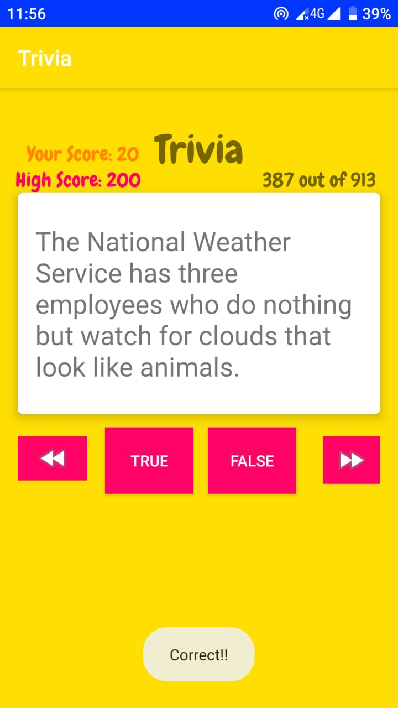

# Trivia

## Introduction
##   Trivia is an application with 900+ question bank. I had used Volley API to fetch data..  
##   <u>Following concepts and technologies are used in the application :<u> 
<ol>
<li> <b>Volley Library </b>– to fetch data from API.
<li> <b>SharedPrefrences </b>–to save app status, user scores and high score, .
</ol>

    
  

If you have any queries or suggestions you can mail me: f158185@nu.edu.pk

You are welcome to suggest any changes, just send a pull request.
